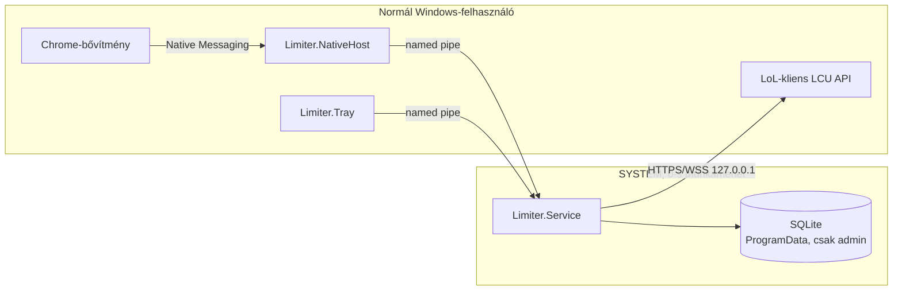

# LoL- és görgetéskorlátozó

Windows 11-es alkalmazás Chrome-bővítménnyel. **Minden keret az előző 24 órára vonatkozik**, éjféli nullázás nélkül.

| Tevékenység | Korlát | A keret elfogyásakor |
|---|---:|---|
| LoL PvP | 3 meccs / 24 óra | Új PvP-keresés megszakítva, meccselfogadás elutasítva |
| Instagram Reels, TikTok, YouTube Shorts, Facebook Reels | Együtt 60 perc / 24 óra | A felület blokkolva |
| Facebook kezdőlapi hírfolyam | Külön 60 perc / 24 óra | A hírfolyam blokkolva |

TFT, botmeccs, gyakorlás, egyéni játék és néző mód nem fogyasztja a LoL-keretet; az igazolt remake visszaadja az alkalmat.
Felismerési vagy működési hibánál a program **enged tovább, és hibát jelez** (tálcaikon, a bővítmény piros „!” jelvénye).

## Szabad felhasználás

Nyugodtan használd, másold, módosítsd és terjeszd tovább – személyes és egyéb célra is. A projekt [MIT licenc](LICENSE) alatt áll. A program garancia nélkül, „ahogy van” formában készült; a korlátok értékeit (3 meccs, 60 perc) és a támogatott oldalakat a saját igényeid szerint át lehet írni. Ha hasznosnak találod, egy csillag vagy egy hivatkozás örömet okoz, de nem kötelező.

## Mit tud az alkalmazás?

A cél az, hogy megfékezze a végtelen görgetést és a túlzott League of Legends-játékot. Három, egymással együttműködő rész dolgozik:

- **Windows-szolgáltatás** (`Limiter.Service`): a háttérben, rendszerjogosultsággal fut, ezért normál felhasználó nem tudja leállítani. Számolja a felhasználást egy védett SQLite-adatbázisban, és ő dönti el, hogy a keret elfogyott-e.
- **Chrome-bővítmény**: figyeli, mennyi időt töltesz Instagram Reelsen, TikTokon, YouTube Shortson és Facebook Reelsen, valamint a Facebook kezdőlapi hírfolyamán. Csak az aktív, látható, használt lapot számolja (háttérlap vagy zárolt képernyő nem számít). Elfogyott kereten blokkolja a felületet. A bővítmény ikonjára kattintva a popupban látod a hátralévő időt.
- **Tálcaalkalmazás** (`Limiter.Tray`): magyar nyelvű tálcaikon, 5 másodpercenként frissül. Zöld = minden rendben, sárga = figyelmeztetés, piros = hiba. A menüben és a „Részletek” ablakban látszik a hátralévő LoL-meccs, a rövidvideó-idő, a hírfolyamidő és a következő felszabaduló keret időpontja.

### Működés röviden

1. **Gördülő 24 órás keret.** Nincs éjféli nullázás: mindig az elmúlt 24 óra felhasználását nézi, így egy meccs vagy egy perc pontosan 24 óra múlva szabadul fel újra.
2. **LoL-meccsek.** A szolgáltatás a League kliens helyi (LCU) API-ját figyeli. Csak a PvP-sorok (pl. rangsorolt, normál) számítanak; TFT, botmeccs, gyakorlás, egyéni játék és néző mód nem. Ha a keret elfogyott, az új PvP-keresést megszakítja, a meccselfogadást elutasítja. Az igazolt remake (újrakezdett meccs) visszaadja az elhasznált alkalmat.
3. **Rövidvideók.** Instagram Reels, TikTok, YouTube Shorts és Facebook Reels **közös** 60 perces keretet használ.
4. **Facebook-hírfolyam.** A kezdőlapi hírfolyam **külön** 60 perces keretet kap.
5. **Hibatűrés.** Ha a felismerés vagy a működés hibázik, a program nem zár ki, hanem tovább enged, és hibát jelez (piros tálcaikon, a bővítmény piros „!” jelvénye).
6. **Kijátszás elleni védelem.** Éles telepítésben a Chrome-szabályok kötelezővé teszik a bővítményt, tiltják az inkognitó- és vendégmódot, a bővítmények fejlesztői módját; a beállítások módosításához rendszergazdai jelszó kell (a gondolat: ezt egy megbízható személy ismeri, nem te).

A telepítésről és az ellenőrzésről lásd lent a hivatkozott útmutatókat.

## Felépítés

```
src/
  Limiter.Core/        Gördülő 24 órás keretek, SQLite-tár, LoL-sorbesorolás, meccsszámláló (platformfüggetlen, tesztelt)
  Limiter.Protocol/    A named pipe protokoll üzenetei és kliense (a szolgáltatás hitelességének ellenőrzésével)
  Limiter.Service/     Windows-szolgáltatás: számlálók, LoL-kliens (LCU) figyelése, pipe-szerver
  Limiter.NativeHost/  Chrome Native Messaging host: továbbítja a bővítmény üzeneteit a szolgáltatásnak
  Limiter.Tray/        Magyar nyelvű tálcaalkalmazás
extension/             Chrome-bővítmény (Manifest V3) + Node-tesztek
installer/             build.ps1, install.ps1, uninstall.ps1, Inno Setup-szkript
tests/                 xUnit-tesztek
docs/                  TELEPITES.md (telepítési útmutató), ELLENORZES.md (próbák)
```



## Gyors parancsok

```bash
dotnet test tests/Limiter.Core.Tests
```

```bash
node --test extension/test/*.test.js
```

Windows alatt a teljes csomag (tesztek, közzététel, bővítménycsomagok, telepítő):

```powershell
powershell -ExecutionPolicy Bypass -File installer\build.ps1
```

Részletek: [docs/TELEPITES.md](docs/TELEPITES.md) és [docs/ELLENORZES.md](docs/ELLENORZES.md).
