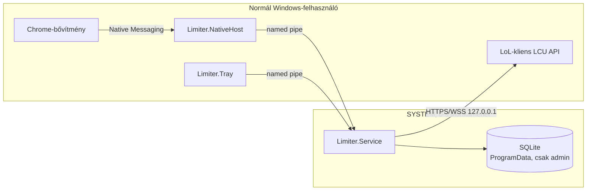

# LoL- és görgetéskorlátozó

Windows 11-es alkalmazás Chrome-bővítménnyel. **Minden keret az előző 24 órára vonatkozik**, éjféli nullázás nélkül.

| Tevékenység | Korlát | A keret elfogyásakor |
|---|---:|---|
| LoL PvP | 3 meccs / 24 óra | Új PvP-keresés megszakítva, meccselfogadás elutasítva |
| Instagram Reels, TikTok, YouTube Shorts, Facebook Reels | Együtt 60 perc / 24 óra | A felület blokkolva |
| Facebook kezdőlapi hírfolyam | Külön 60 perc / 24 óra | A hírfolyam blokkolva |

TFT, botmeccs, gyakorlás, egyéni játék és néző mód nem fogyasztja a LoL-keretet; az igazolt remake visszaadja az alkalmat.
Felismerési vagy működési hibánál a program **enged tovább, és hibát jelez** (tálcaikon, a bővítmény piros „!” jelvénye).

## Felépítés

```
src/
  Limiter.Core/        Gördülő 24 órás keretek, SQLite-tár, LoL-sorbesorolás, meccsszámláló (platformfüggetlen, tesztelt)
  Limiter.Protocol/    A named pipe protokoll üzenetei és kliense (a szolgáltatás hitelességének ellenőrzésével)
  Limiter.Service/     Windows-szolgáltatás: számlálók, LoL-kliens (LCU) figyelése, pipe-szerver
  Limiter.NativeHost/  Chrome Native Messaging host: továbbítja a bővítmény üzeneteit a szolgáltatásnak
  Limiter.Tray/        Magyar nyelvű tálcaalkalmazás
extension/             Chrome-bővítmény (Manifest V3) + Node-tesztek
installer/             build.ps1, install.ps1, uninstall.ps1, Inno Setup-szkript
tests/                 xUnit-tesztek
docs/                  TELEPITES.md (telepítési útmutató), ELLENORZES.md (próbák)
```



## Gyors parancsok

```bash
dotnet test tests/Limiter.Core.Tests
```

```bash
node --test extension/test/*.test.js
```

Windows alatt a teljes csomag (tesztek, közzététel, bővítménycsomagok, telepítő):

```powershell
powershell -ExecutionPolicy Bypass -File installer\build.ps1
```

Részletek: [docs/TELEPITES.md](docs/TELEPITES.md) és [docs/ELLENORZES.md](docs/ELLENORZES.md).
